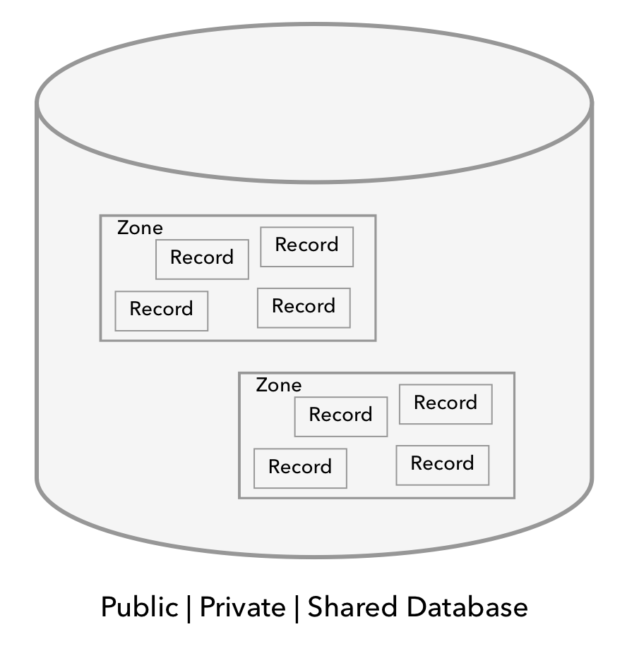

# CloudKit

^ What is CloudKit
^ Architecture
^ Example App
^ Pain points

---

## What is CloudKit

- Direct access to Apples iCloud infrastructure
- Offers NoSQL-like storage
- Only a transport technology, no local persistence
- Used by Apple Photos, iCloud Drive, Notes...
- Available on iOS, macOS and Web

^ Like the now deprecated Dropbox Key-Value-Store or I believe Parse
^ Lots of confusion about, iCloud Drive, CoreData, synced NSUserDefautls etc...
^ Also 1Password, even if bought out of the Mac App Store

---

## Architecture

^ Simplified version of the basic architecture

---

## Container - `CKContainer`

- App specific "CloudKit instance"
- Default: One container per App
- Data separated from other containers

^ No need for user accounts, everything iCloud
^ Personal information not available, only anonymous user ids

---

## Database - `CKDatabase`

- Stores the actual data
- `publicCloudDatabase`, `privateCloudDatabase`, `sharedCloudDatabase`
- No dev access to private or shared databases
- Insert, update, delete and query operations performed on database

^ CKRecordSavePolicy for conflict resolution 
^ public database even without accout
^ shared database since ios10, Apple provides a solution to share access

---

## Record - `CKRecord`

- Different models represented as different record types
- Data stored as key-values pairs
- `[String : String, Number, Data, Date, CLLocation,  CKReference, CKAsset, Arrays]`
- Schema inferred from provided data
- Metadata

^ use subscripts to set and get the data
^ 

---

## Record Zone - `CKRecordZone`

- Group records in Database
- Commit to records are atomic on a zone level

^ you cant reference from one zone to the outer

---

## IDs - `CKRecordID`

- Encapsulating unique `recordName: String`and `zoneID: CKRecordZoneID`
- Bridge between CloudKit data and local data

---

## Subscription - `CKSubscription`

- Delivered by Apple Push Service
- Notifications for operation types: Insert, Update, Delete
- Predicate support

---

## Example - SimpleChat

---

## Pain points

- Callback hell
- Stringly typed
- Error handling
